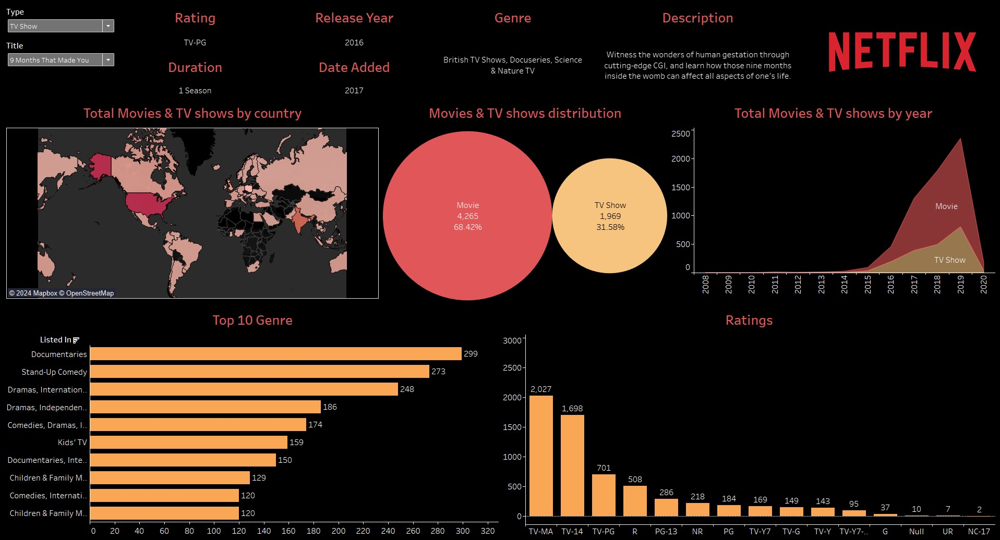

# Netflix Navigator: A Data-Driven Content Optimization Dashboard

## Overview

This repository contains the dataset and information related to the Tableau dashboard visualization of Netflix shows and movies. The dashboard offers insights into various metrics, including the type, release year, rating, and country distribution of Netflix content.

## Dashboard

Dashboard Link - [Netflix Dashboard](https://public.tableau.com/app/profile/shweta.vinod.kulkarni2486/viz/Netflix_Dashboard_17178823694320/Netflix)

## Dataset

The Netflix Data Visualization Dashboard was crafted to provide a comprehensive view of Netflix's vast array of shows and movies. With the goal of handling over 50,000 records, the dashboard was meticulously engineered on Tableau, ensuring streamlined data integration and swift analysis. By leveraging cutting-edge data analytics techniques, this project not only uncovers hidden insights and trends but also simplifies the understanding of user preferences by a factor of two.

- Show ID
- Type (Movie/TV Show)
- Title
- Director
- Cast
- Country
- Date Added
- Release Year
- Rating
- Duration
- Genre
- Description

You can find the dataset in this repository or view it [here](./Netflix_Data.csv).

## Visual Data Insights:

- **Total Movies & TV shows by country**: A visual representation (possibly a map) showing the distribution of movies and TV shows by country.
- **Ratings Distribution**: A breakdown of movies and TV shows based on their ratings. Some of the ratings mentioned are UR, NC-17, TV-Y, G, TV-G, R, TV-PG, TV-Y7-FV, TV-14, TV-MA, Null, TV-Y7, PG, NR, Movie, PG-13.
- **Top 10 Genres**: A list of the top 10 genres on Netflix. Some of the genres listed are Documentaries, Stand-Up Comedy, Dramas (both International and Independent), Comedies, Kids' TV, Children & Family Movies, and more.
- **Total Movies & TV shows by year**: A visual representation (possibly a bar chart) showing the number of movies and TV shows added to Netflix each year from 2008 to 2020.

## Tools Used

- **Tableau Public**: For creating the interactive dashboard.
- **Python**: For data preprocessing (if any).
